# Auditoría de Usabilidad y Experiencia de Usuario (UX) — SaaS Crematorio

> **Objetivo:** Analizar módulo por módulo la experiencia del usuario (Tenant / Funeraria), evaluar el orden, la intuitividad y la facilidad de uso del sistema, garantizando que acciones clave como **iniciar un tracking, registrar una cremación o atender un pedido** sean claras y fluidas.

---

## 1. Mapa de Flujo Operativo Real (¿Cómo opera una funeraria?)

Para que el sistema sea intuitivo, la estructura de la aplicación debe acompañar el día a día del crematorio:

```mermaid
flowchart LR
    A["1. Ingreso del Caso"] --> B["2. Recepción y Pedido"]
    B --> C["3. Operaciones & Planta"]
    C --> D["4. Entrega y Cierre"]
    
    subgraph A["Ingreso"]
      A1["Formulario Web Tutor"]
      A2["Recepción Directa en Sede"]
      A3["Veterinaria Asociada"]
    end

    subgraph B["Comercial & Registro"]
      B1["Crear Mascota + Tutor"]
      B2["Selección de Plan/Urna"]
      B3["Generación Código Tracking"]
    end

    subgraph C["Fases Operativas"]
      C1["Retiro / Recepción Planta"]
      C2["Preparación & Horno"]
      C3["Evidencias / Fotos"]
    end

    subgraph D["Finalización"]
      D1["Certificado de Defunción"]
      D2["Tarjeta Homenaje"]
      D3["Notificación & Cierre"]
    end
```

---

## 2. Diagnóstico Módulo por Módulo

---

### Módulo 1: Inicio / Dashboard General (`/dashboard`)
* **Estado actual:**
  - Muestra tarjetas de métricas (Clientes, Mascotas, Cremaciones, Usuarios).
  - Bloque superior dinámico: detecta y alerta si hay *Solicitudes Web Pendientes* enviadas por los tutores.
  - Sección *"Hoy"* con las cremaciones programadas del día.
  - Botón destacado: `+ Nuevo Registro Rápido`.
* **Puntos Fuertes:**
  - La alerta de solicitudes web es excelente porque prioriza el trabajo urgente.
  - El modal de *Registro Rápido* (QuickRegistrationModal en 4 pasos) ahorra tiempo para casos inmediatos.
* **Oportunidades de Mejora (Implementadas):**
  1. **Confusión en enlaces (RESUELTO):** Los accesos del Dashboard ("Ver Pedidos", tarjeta de "Cremaciones", fila de órdenes recientes y panel "Hoy") ahora dirigen de forma directa a **Recepción y Pedidos** (`/dashboard/recepcion-pedidos`).
  2. **Acceso directo al Tracking (RESUELTO):** Se añadió el botón destacado **"Buscar Tracking"** junto a las acciones principales del Dashboard, abriendo un modal rápido para consultar órdenes en vivo por código/mascota/cliente, ver su estado actual y copiar o enviar el link a la familia por WhatsApp con 1 clic.

---

### Módulo 2: Clientes y Mascotas (`/dashboard/clientes` y `/dashboard/mascotas`)
* **Estado actual:**
  - Vistas estilo catálogo y tarjetas modernas con búsqueda y filtros.
  - En Mascotas: al crear una mascota nueva, aparece un modal inteligente preguntando: *¿Deseas iniciar la Orden de Servicio de Cremación para esta mascota ahora mismo?* (Redirige directo a la orden).
* **Puntos Fuertes:**
  - La conexión entre crear mascota y lanzar la orden evita pasos redundantes.
* **Oportunidades de Mejora:**
  1. **Falta de botón directo de cremación en la tarjeta de mascota:** En la tarjeta de cada mascota (`mascotas/page.tsx`), para iniciar un servicio debes entrar al menú de 3 puntos o registrarla de cero. **Debería existir un botón visible directo en la tarjeta:** `Iniciar Servicio` o icono de llama con tooltip.
  2. **Cliente sin mascota / Mascota sin servicio:** Si un cliente llama de urgencia, obligarlo a registrar cliente, luego ir a mascotas y luego a servicios es largo si no usan el Registro Rápido. Se debe promover siempre el flujo unificado.

---

### Módulo 3: Catálogo de Servicios (`/dashboard/gestion-servicios`)
* **Estado actual:**
  - Permite configurar tipos de cremación (Individual, Comunitaria, etc.), adicionales (urnas, relicarios) y Planes comerciales combinados con control de márgenes.
* **Diagnóstico de Nombre (RESUELTO):**
  - Se renombró en la barra lateral (`Sidebar.tsx`) de *"Gestionar Servicios"* a **"Catálogo de Servicios"** para coincidir exactamente con el título de la página y distinguirse nítidamente de la operación diaria.

---

### Módulo 4: Recepción y Pedidos (`/dashboard/recepcion-pedidos`)
* **Estado actual:**
  - Tablero Kanban (Recibidos, En Proceso, Entregados) y Vista de Lista.
  - Botón destacado: `+ REGISTRAR SERVICIO`.
  - Tarjetas con visualización de código de verificación, plan, mascota, tutor y botón de avance rápido.
* **Puntos Fuertes:**
  - Es el corazón operativo y comercial del negocio. El nuevo nombre **"Recepción y Pedidos"** eliminó la ambigüedad de *"Asignar Servicios"*.
* **Oportunidades de Mejora (Implementadas):**
  1. **Acceso directo al Link de Tracking (RESUELTO):** Cada tarjeta del Kanban cuenta con botones de 1 clic para **"Copiar Link de Tracking"** y **"Enviar por WhatsApp"** directamente a los tutores.

---

### Módulo 5: Operaciones (`/dashboard/operaciones/lista` y `crear-seguimiento`)
* **Estado actual:**
  - `/operaciones/lista`: Panel de trabajo táctico enfocado en operadores de planta y choferes con subida de fotos de evidencia por fase (Recepción, Cámara, Urna, etc.), control de peso y tiempos reales.
  - `/operaciones/crear-seguimiento`: Formulario paso a paso para crear un seguimiento desde cero.
* **Puntos Fuertes:**
  - Excelente diseño móvil para uso en planta con botones táctiles grandes ("Tomar Foto", "Galería").
  - Al concluir el último paso, la orden finaliza en estado `entregado` y cierra modales automáticamente con badge verde de proceso concluido.
* **Oportunidades de Mejora (Implementadas):**
  1. **Clarificación de títulos (RESUELTO):** En el submenú de Operaciones y la cabecera del módulo se actualizó *"Crear Seguimiento"* a **"Iniciar Nuevo Tracking"**, separando conceptualmente la creación comercial (Recepción y Pedidos) del inicio de tracking puramente operativo en planta.

---

### Módulo 6: Documentos y Diseños (`/dashboard/documentos`)
* **Estado actual:**
  - `Emitir Certificado`: Generador PDF de certificados de defunción con firma digital y folio.
  - `Repositorio`: Historial de certificados emitidos para reimpresión.
  - `Tarjetas de Homenaje` (`/documentos/disenos`): Editor y galería de plantillas para tarjetas de despedida / memoriales.
* **Evaluación:**
  - El menú quedó muy limpio tras renombrar *Catálogo Diseños* a *Tarjetas de Homenaje*.
  - Buen flujo: permite emitir documentos tanto desde el flujo de la orden como directamente desde este módulo.

---

### Módulo 7: Historial y Cobros (`/dashboard/ordenes-cremacion`)
* **Estado actual:**
  - Historial administrativo/financiero de cremaciones con pagos, filtros por fechas y descarga de recibos.
* **Oportunidad de Mejora (Implementada):**
  - Se renombró tanto en la barra lateral como en la cabecera de la página a **"Historial y Cobros"** (*Registro financiero de órdenes, cobros y facturación comercial*), evitando confusiones con la cola activa de trabajo del día a día.

---

## 3. Plan de Mejoras Prioritarias para la Máxima Intuitividad

| Prioridad | Mejora Propuesta | Estado | Impacto en la Experiencia |
| :---: | :--- | :---: | :--- |
| **Alta** | **Botón de WhatsApp / Copiar Link directo en tarjetas Kanban:** Añadir un botón rápido en las tarjetas de *Recepción y Pedidos* para enviar el tracking al tutor en 1 solo clic. | **Completado** | Reduce a cero el tiempo de respuesta al cliente tras registrar la mascota. |
| **Alta** | **Botón "Iniciar Servicio" en tarjetas de Mascotas:** En `/dashboard/mascotas`, poner un botón directo en la tarjeta para no depender solo del menú desplegable. | **Completado** | Flujo mucho más ágil cuando un tutor recurrente llega con su mascota. |
| **Alta** | **Humanización a "Angelito" y Flujo Guiado Paso a Paso:** En `/dashboard/recepcion-pedidos/registro`, sustituir la palabra clínica "Paciente" por **"Angelito"**, agregar botones "Siguiente" y "Anterior" entre secciones, y unificar el botón de confirmación de orden eliminando la duplicidad confusa. | **Completado** | Sensibilidad humana superior para el rubro funerario y proceso sin fricción técnica. |
| **Alta** | **Modal Post-Confirmación con Redirección Inteligente:** Al confirmar la orden, consultar al usuario si desea ir directo al **Panel de Trabajo y abrir el Tracking operativo** de la orden, o volver a **Recepción y Pedidos**, incluyendo botones inmediatos para copiar el link y enviar WhatsApp a la familia. | **Completado** | Ahorra múltiples clics al operador de planta y permite notificar a los tutores en el acto. |
| **Media** | **Sidebar: Renombrar "Gestionar Servicios" a "Catálogo de Servicios":** Alinear el sidebar con la cabecera real de la página. | **Completado** | Evita cualquier confusión con la gestión diaria de órdenes. |
| **Media** | **Clarificar Historial Financiero ("Historial y Cobros"):** Renombrar en sidebar y encabezado de `/dashboard/ordenes-cremacion`. | **Completado** | Separa nítidamente la facturación/caja del panel de trabajo diario. |
| **Media** | **Clarificar Operaciones ("Iniciar Nuevo Tracking"):** Renombrar "Crear Seguimiento" a "Iniciar Nuevo Tracking". | **Completado** | Diferencia el alta comercial de la apertura táctica en planta. |
| **Media** | **Dashboard: Botón "Buscar Tracking":** Permitir ingresar el código de 8 caracteres directamente en el dashboard para ver el estado inmediato sin navegar a submenús. | **Completado** | Resuelve llamadas rápidas de clientes preguntando por el estado de su mascota. |

---

## 4. Conclusión

La plataforma cuenta con bases de diseño, arquitectura y automatización de nivel profesional (soporte multi-tenant, roles, subida de evidencias fotográficas, cálculo de costos y cotizador). 

Los recientes ajustes en nombres de menús (**"Recepción y Pedidos"** y **"Tarjetas de Homenaje"**) ordenaron enormemente la jerarquía visual. Incorporar accesos directos rápidos para compartir el tracking a la familia y vincular las mascotas a nuevas órdenes con un solo clic consolidará un flujo de trabajo 100% intuitivo y sin fricción.
