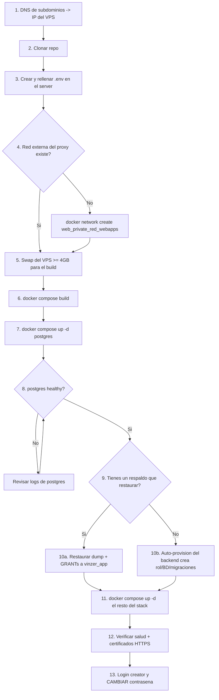

# Flujograma de Instalación — Vinzer (SaaSCrematorio V2)

Runbook para desplegar Vinzer en un servidor (VPS) con Docker, **empezando por la
base de datos**. Complementa a `DESPLIEGUE.md` con el orden exacto de ejecución,
las versiones estables y el procedimiento de restauración de respaldos.

> El stack es **autocontenido**: este `docker-compose.yml` levanta su **propio
> PostgreSQL** (contenedor `vinzer_postgres`, con volumen persistente). Lo único
> externo es el reverse-proxy `nginx-proxy` + `acme-companion` (para HTTPS).

---

## 0. Versiones estables (probadas)

| Componente        | Versión           | De dónde sale                         |
|-------------------|-------------------|---------------------------------------|
| **PostgreSQL**    | `16-alpine`       | `docker-compose.yml` (servicio `postgres`) |
| **Python**        | `3.12-slim`       | `backend/Dockerfile`                  |
| **FastAPI**       | `0.128.0`         | `backend/requirements.txt`            |
| **Uvicorn**       | `0.40.0`          | `backend/requirements.txt`            |
| **SQLAlchemy**    | `2.0.45`          | `backend/requirements.txt`            |
| **Pydantic**      | `2.12.5`          | `backend/requirements.txt`            |
| **psycopg2-binary** | `2.9.11`        | `backend/requirements.txt`            |
| **Node.js**       | `20-alpine`       | `frontend-saas/Dockerfile`            |
| **Next.js**       | `16.1.4`          | `frontend-saas/package.json`          |
| **Redis**         | `7-alpine`        | `docker-compose.yml` (servicio `redis`) |
| **pgAdmin**       | `dpage/pgadmin4:latest` | `docker-compose.yml`       |

> **PostgreSQL 16** es obligatorio: los respaldos (`.dump`) se generan con
> `pg_dump` v16 (formato de archivo `v1.15`). Un `pg_restore` de una versión
> menor (p. ej. 15) falla con `unsupported version (1.15) in file header`.

---

## 1. Diagrama del flujo



---

## 2. Requisitos previos

- Docker + Docker Compose v2 (`docker compose version`).
- Reverse-proxy `nginx-proxy` + `acme-companion` **ya corriendo** en el VPS, con
  su **red externa** de Docker (por defecto `web_private_red_webapps`).
- DNS: todos los subdominios como registro **A** → IP del VPS.
- Cuentas: Cloudflare R2 (2 buckets: archivos + backups), Polar.sh, SMTP Gmail
  (contraseña de aplicación), reCAPTCHA v3.

### Subdominios (registro A → IP del VPS)

| Subdominio            | Variable `.env`   | Sirve                                  |
|-----------------------|-------------------|----------------------------------------|
| `vinzer.cl` + `www`   | `DOMAIN_MAIN`     | Landing (marketing)                    |
| `app.vinzer.cl`       | `DOMAIN_APP`      | Panel del tenant (operadores)          |
| `admin.vinzer.cl`     | `DOMAIN_ADMIN`    | Panel SuperAdmin (creator)             |
| `memorial.vinzer.cl`  | `DOMAIN_MEMORIALS`| Memoriales públicos                    |
| `track.vinzer.cl`     | `DOMAIN_TRACK`    | Seguimiento público (búsqueda por código) |
| `api-saas-keys.vinzer.cl` | `DOMAIN_API`  | Backend (API)                          |
| `pgadmin-saas.vinzer.cl`  | `DOMAIN_PGADMIN` | UI de administración de la BD         |

---

## 3. Paso a paso

### Paso 1 · DNS
Crea los registros **A** de la tabla anterior apuntando a la IP del VPS. Espera a
que propaguen (sin esto, `acme-companion` no emite los certificados).

### Paso 2 · Clonar
```bash
git clone <URL_DEL_REPO> saasVinz
cd saasVinz
```

### Paso 3 · Configurar `.env` (⚠️ NO viaja en git)
El `.env` está en `.gitignore`. En el servidor se crea a mano a partir del
template:
```bash
cp .env.example .env
nano .env
```
Rellena las **tres** secciones (infra, backend, frontend). Puntos críticos:

```dotenv
# --- Base de datos (PROPIA del stack) ---
POSTGRES_HOST=postgres            # nombre del servicio de compose, NO un contenedor externo
POSTGRES_DB=v3_saas
POSTGRES_USER=usuario_pro         # SUPERUSUARIO (migraciones + backups)
POSTGRES_PASSWORD=<pon-una-fuerte>

APP_USER=vinzer_app               # rol de la app (NO superusuario, RLS aplica)
APP_USER_PASSWORD=<pon-una-fuerte>

# --- Backend ---
ENVIRONMENT=production
SECRET_KEY=<genera-una>           # python3 -c "import secrets; print(secrets.token_urlsafe(64))"

# --- Dominios ---
DOMAIN_MAIN=vinzer.cl
DOMAIN_TRACK=track.vinzer.cl
# ... resto de DOMAIN_* y NEXT_PUBLIC_*
```

> **Frontera de seguridad:** solo las `NEXT_PUBLIC_*` llegan al bundle del
> frontend (son públicas). Nunca pongas un secreto con prefijo `NEXT_PUBLIC_`.

> **Ojo con `POSTGRES_USER`/`POSTGRES_PASSWORD`:** la imagen de Postgres solo los
> lee la **primera vez** que inicializa el volumen `postgres_data`. Cambiarlos
> después no surte efecto salvo que recrees el volumen o hagas `ALTER ROLE`.

### Paso 4 · Verificar la red externa del proxy
```bash
docker network ls | grep web_private_red_webapps
# Si no existe:  docker network create web_private_red_webapps
```

### Paso 5 · Swap (evita que el build muera por falta de RAM)
El build del frontend (Next.js 16 + Turbopack) consume mucha memoria. En VPS con
poca RAM, `next build` muere con `signal SIGKILL` (OOM). Prevención:
```bash
free -h                                   # si Swap = 0B, agrégalo:
sudo fallocate -l 4G /swapfile
sudo chmod 600 /swapfile
sudo mkswap /swapfile
sudo swapon /swapfile
echo '/swapfile none swap sw 0 0' | sudo tee -a /etc/fstab
```

### Paso 6 · Build
```bash
docker compose build      # compila backend y frontend (hornea las NEXT_PUBLIC_*)
```

### Paso 7 · Levantar la base de datos primero
```bash
docker compose up -d postgres
docker compose ps          # espera a que 'postgres' quede (healthy)
```

### Paso 8 · Confirmar que Postgres está `healthy`
```bash
docker compose logs postgres --tail 20
docker exec -i vinzer_postgres pg_isready -U usuario_pro -d v3_saas
```

### Paso 9 · ¿Instalación nueva o restaurar respaldo?

- **Nueva (sin respaldo):** salta al Paso 10b.
- **Con respaldo (`.dump`):** haz el Paso 10a **antes** de levantar el backend,
  para que su auto-provisión no pise el dump.

### Paso 10a · Restaurar un respaldo
> El superusuario se llama `usuario_pro` (por `POSTGRES_USER`), **no** `postgres`.

```bash
# 1) (Opcional pero recomendado) BD limpia antes de restaurar
docker exec -i vinzer_postgres psql -U usuario_pro -d postgres \
  -c "DROP DATABASE IF EXISTS v3_saas;" \
  -c "CREATE DATABASE v3_saas OWNER usuario_pro;"

# 2) Restaurar el dump (pg_restore v16 lee el formato v1.15)
docker exec -i vinzer_postgres pg_restore -U usuario_pro -d v3_saas \
  --no-owner --role=usuario_pro \
  < /ruta/al/backup_v3_saas_YYYYMMDD_HHMMSS.dump

# 3) Dar permisos al rol de la app sobre las tablas restauradas.
#    (El dump puede traer GRANTs a un rol viejo; esto asegura vinzer_app.)
docker exec -i vinzer_postgres psql -U usuario_pro -d v3_saas <<'SQL'
DO $$
BEGIN
  IF NOT EXISTS (SELECT 1 FROM pg_roles WHERE rolname = 'vinzer_app') THEN
    CREATE ROLE vinzer_app LOGIN PASSWORD 'CAMBIA_ESTA_PASSWORD'
      NOSUPERUSER NOCREATEDB NOCREATEROLE NOBYPASSRLS;
  END IF;
END $$;
GRANT CONNECT ON DATABASE v3_saas TO vinzer_app;
GRANT USAGE ON SCHEMA public TO vinzer_app;
GRANT SELECT, INSERT, UPDATE, DELETE ON ALL TABLES IN SCHEMA public TO vinzer_app;
GRANT USAGE, SELECT ON ALL SEQUENCES IN SCHEMA public TO vinzer_app;
ALTER DEFAULT PRIVILEGES IN SCHEMA public
  GRANT SELECT, INSERT, UPDATE, DELETE ON TABLES TO vinzer_app;
ALTER DEFAULT PRIVILEGES IN SCHEMA public
  GRANT USAGE, SELECT ON SEQUENCES TO vinzer_app;
SQL
```

> La contraseña de `vinzer_app` en el bloque SQL debe coincidir con
> `APP_USER_PASSWORD` del `.env`.

> Como el backend ya restauró los datos, arráncalo con `RUN_MIGRATIONS=false`
> **en esta primera vez** si quieres evitar que reintente migraciones/seeds sobre
> el dump (las migraciones son idempotentes, pero es más limpio). Quítalo en los
> siguientes arranques.

### Paso 10b · Instalación nueva (auto-provisión)
No hay pasos manuales de BD. Al levantar el backend, su `entrypoint.sh`:
1. Espera a Postgres (`pg_isready`).
2. Provisiona rol `vinzer_app` + base `v3_saas` + privilegios (`provision_db.sh`).
3. Aplica esquema, **todas** las migraciones `sql/*.sql` y los seeds.

Interruptores (en el `environment` del servicio `backend`):
`PROVISION_DB=false` (no crea rol/base) · `RUN_MIGRATIONS=false` (no migra/siembra).

### Paso 11 · Levantar el resto del stack
```bash
docker compose up -d          # backend, redis, frontend, pgadmin
docker compose ps             # todos "running"; postgres "healthy"
```

### Paso 12 · Verificación
```bash
docker compose logs -f backend        # "Setup Complete!" + "Uvicorn running"
docker exec -i vinzer_postgres psql -U vinzer_app -d v3_saas \
  -c "SELECT count(*) FROM sys_tenants;"   # el rol de la app puede leer
docker logs <contenedor_acme_companion> --tail 50   # certificados emitidos
```
En el navegador: `https://vinzer.cl`, `https://admin.vinzer.cl`,
`https://app.vinzer.cl`, `https://track.vinzer.cl`.

### Paso 13 · Seguridad post-instalación (¡IMPORTANTE!)
El seed crea un SuperAdmin por defecto (`creator@saascrematorio.cl` / `juan123`).
**Cambia la contraseña de inmediato** tras el primer login. Checklist:
- [ ] `SECRET_KEY` real y única.
- [ ] `ENVIRONMENT=production`.
- [ ] Contraseña del creator cambiada.
- [ ] `vinzer_app` **no** es superusuario.
- [ ] Contraseñas de pgAdmin y del rol de la app son fuertes.

---

## 4. Actualizaciones (redeploy)

```bash
git pull
# Si cambiaron variables NEXT_PUBLIC_* -> rebuild del frontend (se hornean en build):
docker compose build
docker compose up -d
```
Las migraciones nuevas se aplican solas al reiniciar el backend (idempotentes).

> El `.env` **no** viene en `git pull` (está en `.gitignore`). Si cambió su
> plantilla, replica los cambios a mano en el `.env` del servidor.

---

## 5. Respaldos

- Corren dentro del backend (tarea de fondo con `pg_advisory_lock`) y suben el
  dump al bucket **R2 de backups** (`R2_BUCKET_BACKUPS` + credenciales `*_BACKUP`).
- Se configuran desde el panel SuperAdmin (Configuración → Backups).
- **Prueba un restore** (Paso 10a) al menos una vez: un backup no restaurado no
  es un backup confiable.

---

## 6. Problemas comunes

| Síntoma | Causa | Solución |
|---|---|---|
| `unsupported version (1.15) in file header` | `pg_restore` < 16 sobre dump v16 | Usa `postgres:16-alpine` (ya está en el compose) |
| `role "postgres" does not exist` | El superusuario es `usuario_pro`, no `postgres` | Usa `-U usuario_pro` |
| `role "vinzer_app" does not exist` en GRANTs | El dump referencia un rol distinto | Corre el bloque de GRANTs del Paso 10a |
| `next build` muere con `SIGKILL` | OOM (poca RAM) | Agrega swap (Paso 5) |
| `The data directory was initialized by PostgreSQL 15` | Volumen viejo de otra versión mayor | Borra el volumen `postgres_data` (pierdes datos) o migra con `pg_upgrade` |
| `WARN ... variable is not set` | Variable faltante en `.env` | Complétala; recuerda `NEXT_PUBLIC_VINZER_*` (con Z) |
| No emite certificados HTTPS | DNS no propagado o `VIRTUAL_HOST` mal | Verifica DNS → IP y los dominios del compose |
| `network ... not found` | Red externa del proxy inexistente | Ajusta `EXTERNAL_NETWORK` o créala |

---

## Resumen del orden

```
1. DNS -> IP
2. git clone
3. cp .env.example .env  y rellenar (a mano en el server)
4. Verificar/crear red externa del proxy
5. Swap >= 4GB
6. docker compose build
7. docker compose up -d postgres   -> esperar "healthy"
8. (Restaurar dump + GRANTs)  Ó  (dejar que el backend auto-provisione)
9. docker compose up -d            -> resto del stack
10. Verificar salud + certificados
11. Login creator y CAMBIAR contraseña
```
