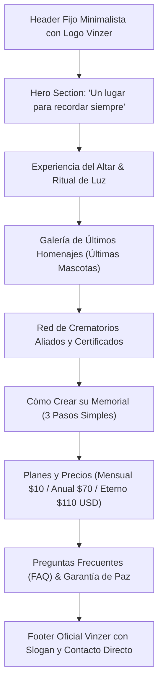

# Plan de Transformación: Landing Page Memorial Vinzer (`memorial.vinzer.cl`)

## 1. Objetivo General
Transformar [memorial.vinzer.cl](https://memorial.vinzer.cl/) en una **Landing Page de una sola página (One-Page)** elegante, emotiva y de alta conversión. Debe preservar la identidad corporativa manteniendo el **logo oficial de Vinzer**, dar protagonismo visible a los **crematorios asociados** y actualizar la oferta a **3 planes exclusivos en USD**: **Mensual (10 USD)**, **Anual (70 USD)** y **Eterno (110 USD)**.

---

## 2. Puntos Clave Requeridos
1. **Mantener el Logo de Vinzer**: Utilizar los assets oficiales de marca (`/logo-vinzer.webp` / `/minilogo.webp`) en el Header y Footer con estética refinada.
2. **Estructura Estricta One-Page**:
   - Eliminar navegación que disperse a páginas secundarias (`/our-services`, `/planning`).
   - El Header ahora tendrá enlaces de navegación suave mediante anclas (`#experiencia`, `#galeria`, `#crematorios`, `#planes`, `#faq`).
   - Botón directo de llamada a la acción hacia WhatsApp y selección de plan.
3. **Visibilidad de los Crematorios**:
   - Tarjetas de memoriales recientes con el sello/nombre del crematorio que prestó el servicio destacado visualmente.
   - Nueva sección dedicada: **"Red de Crematorios Autorizados"** para validar la trazabilidad y confianza.
4. **Nuevos Planes de Precios**:
   - **Plan Mensual**: **10 USD / mes**.
   - **Plan Anual**: **70 USD / año** *(~42% de ahorro respecto al mensual)*.
   - **Plan Eterno**: **110 USD pago único** *(Destacado / Recomendado: recuerdo permanente sin suscripción)*.

---

## 3. Arquitectura de Secciones de la Landing Page

---

## 4. Detalle de Secciones y Contenido

### Sección 1: Header Flotante Premium
- **Branding**: Logo oficial de Vinzer (`/logo-vinzer.webp`) con isotipo dorado y texto *Vinzer Memorial*.
- **Navegación One-Page**:
  - `Experiencia` -> `#experiencia`
  - `Últimos Homenajes` -> `#galeria`
  - `Crematorios` -> `#crematorios`
  - `Planes` -> `#planes`
  - `Preguntas` -> `#faq`
- **Acciones**: Selector de idioma (ES / EN) y Botón CTA **"Crear Memorial"** directo a la sección de planes.

### Sección 2: Hero Emocional
- Imagen de fondo serena con máscara de degradado suave.
- Titular: *"Un lugar sagrado para recordar a quien nunca te olvidará"*.
- Subtítulo: *"Preserva el legado y amor de tu mascota en un santuario digital interactivo con velas, historias y dedicatorias."*
- Botones de acción:
  - Primario: *"Ver Planes de Homenaje"* (scroll a `#planes`).
  - Secundario: *"Ver Altar Demostrativo"* (scroll a `#experiencia`).

### Sección 3: La Experiencia del Altar Virtual
- Explicación de los dos pilares:
  - **Encendido de Velas Virtuales**: Acto de intención y calidez desde cualquier rincón del mundo.
  - **Ritual de Luz**: Mensajes y dedicatorias privadas o familiares para acompañar el duelo.
- Mockup o preview visual envolvente del altar digital.

### Sección 4: Galería de Últimos Homenajes
- Conexión con `/api/internal/memorials/` para obtener las últimas mascotas registradas.
- Tarjetas estilo polaroid contemporánea:
  - Fotografía en alta calidad de la mascota.
  - Nombre en tipografía elegante.
  - Años de vida y amor compartido.
  - **Insignia del Crematorio**: Badge con logo o nombre del crematorio certificado donde se realizó la despedida.
  - Enlace al memorial público del recuerdo.

### Sección 5: Red de Crematorios Autorizados (Nueva)
- Demuestra que el memorial no es una web aislada, sino parte del ecosistema oficial de crematorios que usan la plataforma Vinzer.
- Insignia de *"Trazabilidad y Calidad Garantizada"*.
- Mención de crematorios asociados y cómo las familias reciben su código de acceso garantizado.

### Sección 6: Cómo Crear el Memorial
- **01. Elegir Plan**: Mensual, Anual o Eterno.
- **02. Subir Fotos y Recuerdos**: Cargar fotos favoritas, fecha de partida y palabras desde el corazón.
- **03. Encender su Luz**: Compartir el enlace con la familia y amigos para recibir velas y dedicatorias.

### Sección 7: Tabla de Planes (3 Planes en USD)

| Característica | Plan Mensual | Plan Anual *(Ahorro)* | Plan Eterno *(Más Elegido)* |
| :--- | :---: | :---: | :---: |
| **Precio** | **$10 USD** / mes | **$70 USD** / año | **$110 USD** pago único |
| **Facturación** | Mensual recurrente | Anual recurrente | De por vida (Sin suscripciones) |
| **Fotos del Recuerdo** | Hasta 3 fotografías | Hasta 10 fotografías | Galería ilimitada (hasta 25+) |
| **Velas y Dedicatorias** | Hasta 10 dedicatorias | Hasta 35 dedicatorias | Dedicatorias y velas infinitas |
| **Música y Ritual de Luz** | Estándar | Personalizado | Premium con temas exclusivos |
| **Permanencia del Altar** | Activo mientras dure suscripción | Activo todo el año | **Para siempre (Perpetuo)** |
| **Certificado Conmemorativo** | Digital básico | Digital de alta resolución | Digital + listo para imprimir QR |
| **Botón de Acción** | *"Elegir Mensual"* | *"Elegir Anual"* | *"Elegir Eterno"* |

### Sección 8: Preguntas Frecuentes (FAQ)
- ¿Cómo accedo a editar las fotos de mi mascota?
- ¿Qué pasa si elijo el plan Eterno? ¿Realmente nunca vencerá?
- ¿Pueden mis familiares encender velas desde sus teléfonos?
- ¿Mi crematorio me entrega acceso directo o puedo contratarlo yo mismo?
- Asistencia directa por WhatsApp con un solo clic.

### Sección 9: Footer Corporativo Vinzer
- Logo oficial de Vinzer con frase de marca: *"El valor de una despedida digna"*.
- Enlaces de políticas, contacto por WhatsApp y copyright oficial 2026.

---

## 5. Archivos a Modificar en el Proyecto

1. [frontend-saas/src/app/(public)/public/page.tsx](file:///c:/SISTEMAS-PRUEBA/SaaSCrematorio_V2/frontend-saas/src/app/(public)/public/page.tsx):
   - Convertir toda la vista en la One-Page completa con las nuevas secciones.
2. [frontend-saas/src/components/public/PublicHeader.tsx](file:///c:/SISTEMAS-PRUEBA/SaaSCrematorio_V2/frontend-saas/src/components/public/PublicHeader.tsx):
   - Reemplazar logo por `/logo-vinzer.webp` y actualizar menú con anclas internas `#`.
3. [frontend-saas/src/components/public/PricingSection.tsx](file:///c:/SISTEMAS-PRUEBA/SaaSCrematorio_V2/frontend-saas/src/components/public/PricingSection.tsx) & [TributePlans.tsx](file:///c:/SISTEMAS-PRUEBA/SaaSCrematorio_V2/frontend-saas/src/components/memorial/TributePlans.tsx):
   - Configurar los 3 planes definitivos: Mensual ($10 USD), Anual ($70 USD) y Eterno ($110 USD).
4. [frontend-saas/src/lib/translations.ts](file:///c:/SISTEMAS-PRUEBA/SaaSCrematorio_V2/frontend-saas/src/lib/translations.ts):
   - Actualizar textos en español e inglés para reflejar los nuevos nombres, precios y beneficios de los 3 planes.

---

## 6. Siguientes Pasos
Una vez aprobado este plan, aplicaremos los cambios paso a paso y validaremos visualmente que la landing page memorial mantenga el logo de Vinzer, luzca moderna, fluida y con los 3 planes y crematorios visibles.
